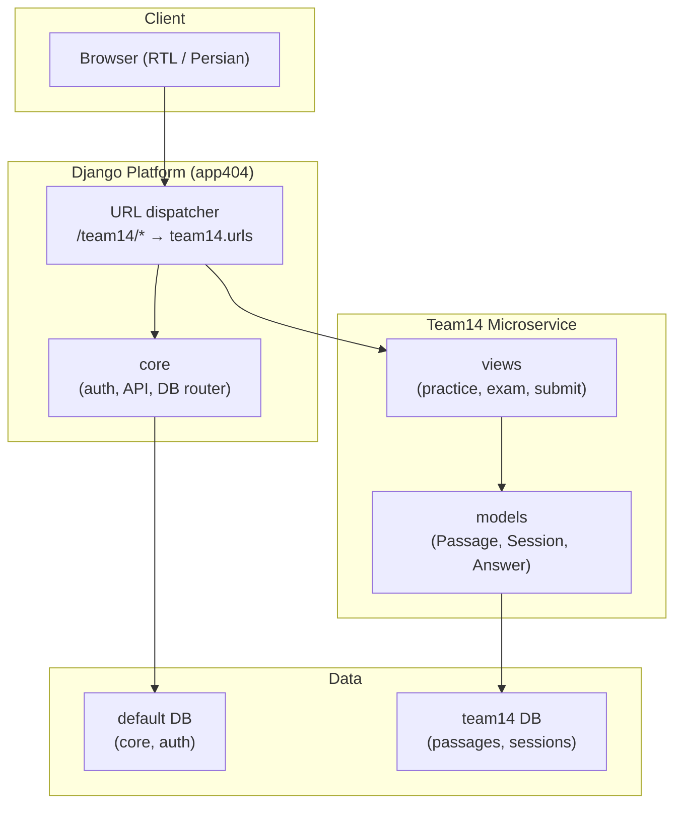

# Software Engineering 1404-01 — Group 14

[](https://www.djangoproject.com/)
[](https://www.python.org/)
[](./)

A **Django-based educational platform** in which multiple team microservices are integrated under a single application. This repository is a **fork** of the main course project; each team owns a microservice (Django app) mounted on a shared core (authentication, URL routing, per-app database routing).

---

## Table of Contents

- [Overview](#overview)
- [Architecture](#architecture)
- [Repository Structure](#repository-structure)
- [Team14 Microservice — Reading Practice & Exam](#team14-microservice--reading-practice--exam)
  - [Purpose & Design Goals](#purpose--design-goals)
  - [Features](#features)
  - [User Flows](#user-flows)
  - [Tech Stack & Dependencies](#tech-stack--dependencies)
  - [Project Layout](#project-layout)
  - [API Reference](#api-reference)
  - [URL Reference](#url-reference)
  - [Data Models](#data-models)
  - [Configuration](#configuration)
  - [Security](#security)
  - [Deployment (Docker)](#deployment-docker)
  - [Local Development](#local-development)
  - [Testing](#testing)
- [Getting Started](#getting-started)
- [License](#license)

---

## Overview

| Aspect | Description |
|--------|-------------|
| **Framework** | Django 4.2 |
| **Architecture** | Monorepo with pluggable team apps; each app can use a dedicated database and is exposed under a path prefix (e.g. `/team14/`). |
| **Authentication** | Central auth (login / signup / logout) and cookie-based JWT for API; team apps use `@login_required` and `@api_login_required` as needed. |
| **Database** | Default DB for `core`; per-team DB alias (e.g. `team14`) via `core.db_router.TeamPerAppRouter`. |
| **Deployment** | Single Django process or standalone service behind Nginx (e.g. Team14 Docker Compose). |

Team apps are enabled via the `TEAM_APPS` environment variable (comma-separated). The platform microservices page links to each team’s root URL.

---

## Architecture



- **Request flow:** Browser → Django (URL dispatcher) → core middleware (auth/session) → team app views → team app models → team database.
- **Database routing:** Models with `app_label in TEAM_APPS` read/write to the database alias matching the app name (e.g. `team14` → `DATABASES["team14"]`).

---

## Repository Structure

```
Software-Engineering-1404-01_G1/
├── app404/                    # Main Django project
│   ├── settings.py            # TEAM_APPS, DATABASES, JWT, CORS
│   ├── urls.py                # Mounts each TEAM_APPS at /<app>/
│   └── wsgi.py
├── core/                      # Shared platform layer
│   ├── auth.py                # api_login_required
│   ├── db_router.py           # TeamPerAppRouter
│   ├── middleware/            # JWT authentication
│   ├── web_views.py           # home, microservices page
│   └── web_auth_views.py      # login, signup, logout
├── templates/                 # Global templates
│   └── microservice.html      # Microservices grid (links to /team14/, etc.)
├── team14/                    # Team14 microservice (this team’s app)
│   ├── models/
│   ├── templates/team14/
│   ├── static/team14/
│   ├── views.py
│   ├── urls.py
│   ├── Dockerfile
│   ├── docker-compose.yml
│   └── gateway.conf
├── manage.py
├── .env.example
└── README.md
```

---

## Team14 Microservice — Reading Practice & Exam

**Team14** is a **TOEFL-style reading comprehension** microservice: users practice with passages at three difficulty levels and take a timed exam. The interface is **Persian (RTL)** and uses the platform’s authentication and shared UI components.

---

### Purpose & Design Goals

- **Practice:** Offer leveled reading passages (Easy, Medium, Hard) with multiple-choice questions and immediate feedback.
- **Assessment:** Provide a timed exam (e.g. 30 minutes) with a random passage, scored out of 30, with a simple evaluation (عالی / خوب / نیاز به تمرین).
- **Persistence:** Store user sessions and answers in a dedicated database; show last exam score on the home page for logged-in users.
- **Extensibility:** Data models support future skill analytics (`SkillScore`) and anti-cheat logging (`AntiCheatLog`).

---

### Features

| Feature | Description |
|--------|-------------|
| **Landing** | Home page with optional last exam score for authenticated users; entry to training levels and exam. |
| **Training levels** | Single page to choose difficulty (آسان / متوسط / سخت) and navigate to passage lists. |
| **Passage lists** | Per-level lists (easy, medium, hard) with **filters:** topic (Biology, History, Astronomy, Geology, Anthropology), text length (short / medium / long), and search in title/text. Each card shows title, topic, length, question count, and estimated time. |
| **Practice session** | One passage and its questions; **30-minute** time limit; answers submitted via AJAX (`POST /team14/submit-answer/`); finish button to compute score and redirect to result. |
| **Practice result** | Per-question breakdown (correct/incorrect, correct answer, user answer); total score as percentage. |
| **Exam** | Entry page → start exam (random passage, 30 min) → exam page with timer → finish → result page with score out of 30 and evaluation message. |
| **API ping** | `GET /team14/ping/` for health/identity (JWT required); returns `{"team": "team14", "ok": true}`. |

---

### User Flows

**Practice flow**

1. User opens `/team14/` (optionally logs in via `/auth/`).
2. Goes to **Training levels** → chooses **Easy**, **Medium**, or **Hard**.
3. Lands on passage list (e.g. `/team14/easy/`) and can filter by topic, text length, or search.
4. Clicks a passage → **Practice session** (`/team14/practice/<passage_id>/`). A new `UserSession` (mode=`practice`) is created; any previous open practice for that passage is closed.
5. Reads passage and selects answers; each selection is sent via `POST /team14/submit-answer/`.
6. Clicks **Finish** → `GET /team14/practice/finish/<session_id>/` → server marks answers correct/incorrect, sets `end_time` and `total_score` (percentage) → redirect to **Practice result** (`/team14/practice/result/<session_id>/`).

**Exam flow**

1. User opens **Exam** from home or training levels → `/team14/exam/`.
2. Clicks start → `GET /team14/exam/start/` → server picks a random passage, creates `UserSession` (mode=`exam`, `exam_duration=1800`), renders exam page with timer.
3. User answers questions; answers submitted via same `submit-answer` endpoint (exam sessions are distinguished by `mode`).
4. When time is up or user finishes → `GET /team14/exam/finish/<session_id>/` → server grades, sets `total_score` (out of 30) and `end_time` → redirect to **Exam result** (`/team14/exam/result/<session_id>/`).
5. Result page shows score out of 30, percentage, duration, and evaluation (e.g. عالی for ≥20, خوب for ≥10, نیاز به تمرین otherwise).

---

### Tech Stack & Dependencies

| Layer | Technology |
|-------|------------|
| **Backend** | Django 4.2, Python 3.12 |
| **Database** | SQLite per app by default (`team14/team14.sqlite3`); overridable via `TEAM14_DATABASE_URL` (e.g. MySQL). |
| **Auth** | Django session + `@login_required` for pages; `@api_login_required` for `/team14/ping/`. |
| **Frontend** | Server-rendered HTML, minimal JavaScript (fetch for submit-answer), RTL layout, Vazirmatn font; shared header and social section partials. |
| **Serving** | Django dev server or Gunicorn; optional Nginx as reverse proxy (see [Deployment](#deployment-docker)). |

**Team14-specific requirements** (`team14/requirements.txt`): Django 4.2.x, PyJWT, django-environ, django-cors-headers, mysqlclient, PyMySQL, gunicorn, whitenoise (typically aligned with main project).

---

### Project Layout

```
team14/
├── models/
│   ├── __init__.py
│   ├── question.py       # Passage, Question, Option
│   ├── answer.py         # UserSession, UserAnswer
│   └── analytics.py      # SkillScore, AntiCheatLog
├── templates/team14/
│   ├── index.html
│   ├── training_levels.html
│   ├── practice_passages.html
│   ├── practice_page.html
│   ├── practice_result.html
│   ├── exam_page.html
│   ├── exam.html
│   ├── exam_result.html
│   └── public/
│       ├── header.html
│       └── social-section.html
├── static/team14/styles/
│   ├── common.css
│   └── style.css
├── views.py
├── urls.py
├── admin.py
├── apps.py
├── tests.py
├── requirements.txt
├── Dockerfile
├── docker-compose.yml
├── gateway.conf
└── migrations/
```

---

### API Reference

#### `POST /team14/submit-answer/`

Stores or updates the authenticated user’s answer for a question in an active practice or exam session.

**Request**

- **Method:** `POST`
- **Content-Type:** `application/json`
- **Auth:** Session (cookie); user must own the session.

**Body**

| Field | Type | Required | Description |
|-------|------|----------|-------------|
| `session_id` | integer | Yes | ID of the `UserSession` (practice or exam). |
| `question_id` | integer | Yes | ID of the `Question` (must belong to the session’s passage). |
| `option_id` | integer | Yes | ID of the selected `Option`. |

**Responses**

| Status | Body | Condition |
|--------|------|-----------|
| `200` | `{"success": true}` | Answer saved or updated. |
| `400` | `{"success": false, "error": "<message>"}` | Invalid payload, session not found, question not in passage, or practice time exceeded (زمان تمرین به پایان رسیده است). |
| `403` | `{"success": false}` | Not POST or user not authenticated. |

**Notes**

- Practice sessions enforce a 30-minute limit from `start_time`; after that, submit returns 400.
- If the user changes an existing answer, `changed_count` on `UserAnswer` is incremented.
- Correctness is computed when the session is finished (`finish_practice` / `finish_exam`), not on submit.

---

#### `GET /team14/ping/`

Health/identity endpoint for the microservice.

**Request**

- **Method:** `GET`
- **Auth:** JWT (cookie or header); `@api_login_required` — unauthenticated requests receive 401.

**Response**

- **200:** `{"team": "team14", "ok": true}`

---

### URL Reference

All routes are under the **`/team14/`** prefix when the app is mounted in the platform or behind the Nginx gateway.

| Path | View | Auth | Description |
|------|------|------|-------------|
| `/team14/` | `base` / `index` | No / Yes | Landing; with auth, shows last exam score and “has taken exam”. |
| `/team14/ping/` | `ping` | JWT | Returns `{team, ok}`; 401 if not authenticated. |
| `/team14/reading/training-levels/` | `training_levels` | No | Page to choose difficulty (easy / medium / hard). |
| `/team14/easy/` | `easy_level` | Login | List of easy passages; query params: `topic`, `text_length`, `search`. |
| `/team14/medium/` | `mid_level` | Login | List of medium passages; same filters. |
| `/team14/hard/` | `hard_level` | Login | List of hard passages; same filters. |
| `/team14/exam/` | `Exam_Page` | No | Exam info and entry. |
| `/team14/exam/start/` | `start_exam` | Login | Creates exam session (random passage, 30 min), renders exam page. |
| `/team14/exam/finish/<session_id>/` | `finish_exam` | Login | Grades exam, sets score and end_time; redirects to result. |
| `/team14/exam/result/<session_id>/` | `exam_result` | Login | Exam result page (score out of 30, evaluation, duration). |
| `/team14/practice/<passage_id>/` | `practice_page` | Login | Practice session for one passage; creates/continues session. |
| `/team14/practice/finish/<session_id>/` | `finish_practice` | Login | Grades practice, sets score and end_time; redirects to result. |
| `/team14/practice/result/<session_id>/` | `practice_result` | Login | Practice result page (per-question breakdown, percentage). |
| `/team14/submit-answer/` | `submit_answer` | Login | POST; see [API Reference](#api-reference). |

---

### Data Models

#### Passage

| Field | Type | Description |
|-------|------|-------------|
| `title` | CharField(255) | Passage title. |
| `text` | TextField | Full passage content. |
| `topic` | CharField(50) | One of: `biology`, `history`, `astronomy`, `geology`, `anthropology`. |
| `difficulty_level` | CharField(10) | `easy`, `medium`, `hard`. |
| `text_length` | IntegerField | Character count (used for filters and estimated time). |
| `rubric_version` | CharField(50) | Rubric version identifier. |
| `version` | IntegerField | Version number; default 1. |
| `created_at` | DateTimeField | Auto-set on create. |

#### Question

| Field | Type | Description |
|-------|------|-------------|
| `passage` | FK(Passage) | Related passage. |
| `question_text` | TextField | Question text. |
| `question_type` | CharField(30) | One of: `factual`, `negative_factual`, `inference`, `vocabulary`, `insert_sentence`, `summary`, `table`. |
| `correct_answer` | TextField | Text of correct answer (denormalized). |
| `score` | IntegerField | Point value; default 1. |

#### Option

| Field | Type | Description |
|-------|------|-------------|
| `question` | FK(Question) | Related question. |
| `text` | TextField | Option text. |
| `is_correct` | BooleanField | True for the correct option. |

#### UserSession

| Field | Type | Description |
|-------|------|-------------|
| `user_id` | CharField(36) | Platform user ID (string). |
| `mode` | CharField(10) | `exam` or `practice`. |
| `start_time` | DateTimeField | Session start. |
| `end_time` | DateTimeField, null | Set when session is finished. |
| `passage` | FK(Passage), null | Passage for this session. |
| `total_score` | IntegerField, null | Percentage (practice) or score out of 30 (exam). |
| `scaled_score` | FloatField, null | Reserved. |
| `exam_version` | CharField(50) | Reserved. |
| `exam_duration` | IntegerField, null | Duration in seconds (exam only; e.g. 1800). |

#### UserAnswer

| Field | Type | Description |
|-------|------|-------------|
| `session` | FK(UserSession) | Session this answer belongs to. |
| `question` | FK(Question) | Question answered. |
| `selected_option` | FK(Option), null | Chosen option. |
| `is_correct` | BooleanField | Set on session finish. |
| `response_time` | FloatField | Time in seconds (reserved). |
| `changed_count` | IntegerField | Number of times the answer was changed; default 0. |

#### SkillScore (analytics)

| Field | Type | Description |
|-------|------|-------------|
| `session` | FK(UserSession) | Session. |
| `skill_type` | CharField(30) | e.g. `main_idea`, `inference`, `vocabulary`. |
| `score` | FloatField | Skill score. |

#### AntiCheatLog (analytics)

| Field | Type | Description |
|-------|------|-------------|
| `session` | FK(UserSession) | Session. |
| `event_type` | CharField(30) | e.g. `focus_lost`, `answer_changed`, `long_idle`. |
| `timestamp` | DateTimeField | Auto-set. |
| `metadata` | JSONField, null | Extra event data. |

---

### Configuration

**Platform (`.env`)**

| Variable | Description | Example |
|----------|-------------|---------|
| `TEAM_APPS` | Comma-separated list of team app names | `team1,team2,...,team14` |
| `DATABASE_URL` | Default DB (core) | `sqlite:///db.sqlite3` |
| `TEAM14_DATABASE_URL` | Team14 DB (optional) | `sqlite:///team14/team14.sqlite3` or MySQL URL |
| `JWT_SECRET` | JWT signing secret | — |
| `DJANGO_ALLOWED_HOSTS` | Allowed hosts | `localhost,127.0.0.1` |

If `TEAM14_DATABASE_URL` is not set, the app uses `sqlite:///<BASE_DIR>/team14/team14.sqlite3`.

**Team14 constants (in code)**

- Practice time limit: **30 minutes** (`PRACTICE_TIME_MINUTES` in `views.py`).
- Exam duration: **30 minutes** (1800 seconds) in `start_exam`.

---

### Security

- **Authentication:** All practice/exam and submit-answer flows require a logged-in user; unauthenticated users are redirected to `/auth/` or receive 403/401.
- **Session ownership:** Every session lookup uses `user_id=str(request.user.id)` so users can only access their own sessions and results.
- **Practice time limit:** Submitting answers after 30 minutes from practice start returns 400 with a Persian message.
- **CSRF:** `submit_answer` is decorated with `@csrf_exempt` for AJAX; in production, consider using a CSRF token (e.g. from cookie or form) instead of exempting.
- **Data validation:** Session, question, and option IDs are validated; question must belong to the session’s passage.

---

### Deployment (Docker)

Team14 can run as a standalone stack (app + Nginx) for integration or production.

**Components**

- **team14_service:** Django app run with Gunicorn (`app404.wsgi:application`) on port 8000; build context is project root, Dockerfile at `team14/Dockerfile`.
- **team14_gateway:** Nginx container; mounts `team14/gateway.conf` and serves `/team14/` by proxying to `team14_service:8000`, with URL rewriting and `sub_filter` so links point to `/team14/`. Static and media are served from `/team14/static/` and `/team14/media/` (alias to shared static/media if mounted).

**Network**

- Uses external network `app404_net`. Create it if not already present:  
  `docker network create app404_net`

**Commands (from repository root)**

```bash
docker network create app404_net
cd team14
docker compose up --build
```

Then open `http://localhost/team14/`. Ensure the app has migrations applied and, if needed, load passages (e.g. via Django admin or fixtures).

---

### Local Development

1. **Clone and virtualenv**

   ```bash
   git clone <repo-url>
   cd Software-Engineering-1404-01_G1
   python -m venv .venv
   .venv\Scripts\activate   # Windows
   # source .venv/bin/activate  # Linux/macOS
   pip install -r requirements.txt   # if present at root; else install Django etc.
   pip install -r team14/requirements.txt
   ```

2. **Environment**

   ```bash
   cp .env.example .env
   # Edit .env: set TEAM_APPS to include team14 (e.g. team14 or team1,...,team14)
   ```

3. **Migrations**

   ```bash
   python manage.py migrate
   python manage.py migrate --database=team14
   ```

4. **Run**

   ```bash
   python manage.py runserver
   ```

5. **Open**

   - Microservices: `http://127.0.0.1:8000/microservices/`
   - Team14: `http://127.0.0.1:8000/team14/`
   - Auth: `http://127.0.0.1:8000/auth/`

---

### Testing

**Team14 tests**

- **`TeamPingTests.test_ping_requires_auth`:** Asserts that `GET /team14/ping/` returns **401** when the client is not authenticated.

**Run**

```bash
python manage.py test team14
```

---

## Getting Started

1. Clone the repository (or your fork).
2. Copy `.env.example` to `.env` and set `TEAM_APPS` (include `team14`).
3. Create and activate a virtualenv; install dependencies (root and/or `team14/requirements.txt`).
4. Run migrations:  
   `python manage.py migrate`  
   `python manage.py migrate --database=team14`
5. Start the server: `python manage.py runserver`.
6. Visit `http://127.0.0.1:8000/team14/` or the microservices page.

For **Docker (Team14 only)**, see [Deployment (Docker)](#deployment-docker).

---

## License

See the repository or upstream project for license information.
